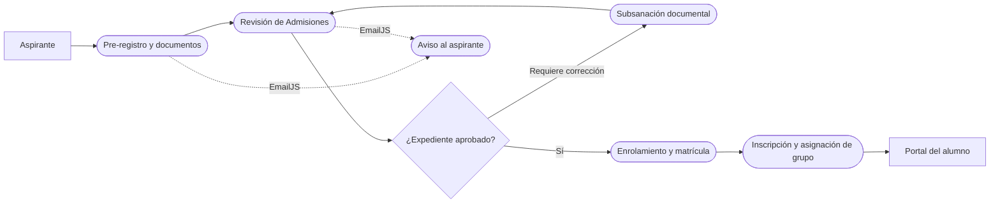

<p align="center">
  
</p>

<h1 align="center">AUT-INS API</h1>

<p align="center">
  API para la administración y el control del proceso de admisión e inscripción escolar.
</p>

<p align="center">
  
  
  
  
  
</p>

---

## Descripción

AUT-INS busca sustituir el manejo manual de inscripciones por un proceso centralizado, seguro y trazable. El sistema acompaña al aspirante desde su pre-registro y carga documental hasta la emisión del dictamen, su enrolamiento y la generación de su matrícula institucional.

El alcance prioritario se concentra en:

- Registro y seguimiento de aspirantes.
- Revisión y dictamen de documentación.
- Corrección de documentos observados.
- Conversión de aspirantes aceptados en alumnos.
- Inscripción y asignación de grupo con control de cupo.
- Consulta del avance del trámite.
- Notificaciones por correo dirigidas exclusivamente al aspirante.

Los módulos académicos avanzados, la mensajería interna y los reportes se conservan como componentes complementarios.

## Estado actual

> **Proyecto en fase de diseño.** El repositorio contiene la base documental y la estructura inicial de trabajo. La implementación de la API todavía no ha comenzado.

| Área | Estado |
|---|---|
| Análisis del problema | Concluido |
| Actores, responsabilidades y UFP | Concluido |
| Cadena de valor | Concluida |
| Tecnologías confirmadas | Registradas |
| Análisis de requisitos y entidades | Concluido |
| Normalización y modelo físico | Pendiente |
| Identificación de recursos de la API | Concluida |
| Endpoints, parámetros y respuestas | En diseño |
| Desarrollo y pruebas | Pendiente |

## Flujo general



## Tecnologías confirmadas

| Tecnología | Responsabilidad |
|---|---|
| MySQL | Persistencia relacional de la información escolar. |
| Microsoft Azure | Alojamiento exclusivo de la base de datos MySQL. |
| Prisma ORM | Acceso a datos, modelos y migraciones. |
| JWT | Autenticación y autorización de rutas por rol. |
| EmailJS | Notificaciones al aspirante durante su trámite. |
| Git y GitHub | Control de versiones, revisión y colaboración. |

El entorno de ejecución y el servicio donde se desplegará la API permanecen pendientes de confirmación. GitHub almacenará el código, pero no sustituirá al servicio de ejecución.

## Estructura del repositorio

```text
aut-ins-api/
├── .github/                 Plantillas para la colaboración
├── docs/                    Documentación funcional y técnica
│   ├── assets/              Recursos visuales del repositorio
│   └── diagramas/           Diagramas versionados
├── prisma/                  Futuro esquema y migraciones
├── src/                     Futuro código fuente de la API
├── tests/                   Futuras pruebas automatizadas
├── .env.example             Variables necesarias sin secretos
├── CONTRIBUTING.md          Flujo de colaboración
├── SECURITY.md              Reglas básicas de seguridad
└── CHANGELOG.md             Historial de entregas
```

## Documentación

- [Índice documental](docs/README.md)
- [Alcance funcional](docs/alcance.md)
- [Tecnologías y decisiones](docs/tecnologias.md)
- [Modelo de datos](docs/modelo-datos.md)
- [Diseño preliminar de la API](docs/diseno-api.md)
- [Organización Scrum](docs/scrum.md)
- [Casos de uso — nivel 0](docs/diagramas/casos-de-uso-nivel-0.md)

## Forma de trabajo

```text
main
└── develop
    ├── feature/SCRUM-XX-descripcion
    ├── fix/SCRUM-XX-descripcion
    └── docs/SCRUM-XX-descripcion
```

Cada cambio deberá estar vinculado con una tarea del tablero, realizarse en una rama independiente y llegar a `develop` mediante una revisión. Las reglas completas se encuentran en [CONTRIBUTING.md](CONTRIBUTING.md).

## Equipo

- Carlos Eduardo Martínez Morales
- Daen Sánchez Marín
- Fernando Pérez Acuautla
- Fernando Aguilar Velázquez

## Aviso

Este repositorio corresponde a un proyecto académico. La licencia y las condiciones de distribución se definirán antes de su publicación definitiva.
