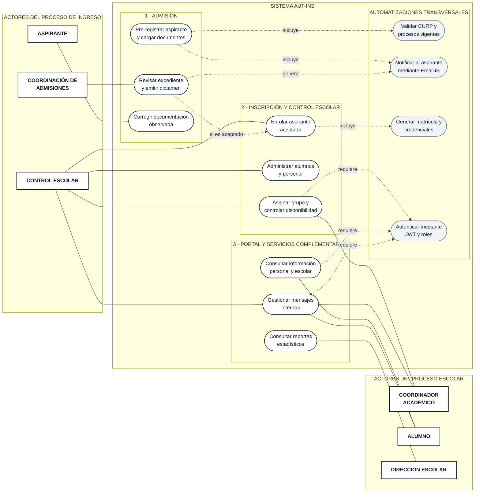

# Diagrama 1. Casos de uso — Nivel 0

El sistema se representa como el límite que contiene las funciones y automatizaciones. Por esta razón, `Sistema` no aparece como actor externo.

Dirección Escolar se considera un actor complementario porque consulta reportes generales. Si el equipo decide excluir ese módulo del alcance evaluado, deberá retirarse también este actor.
